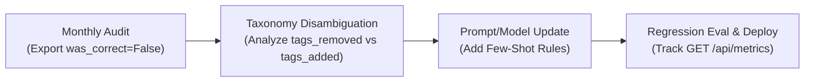

# Model Retraining & Continuous Feedback Strategy

This document outlines the operational flywheel for converting captured human reviewer corrections into model performance improvements. All recommendations are grounded directly in the database schema (`posts`, `model_suggestions`, `human_corrections`), API metrics endpoint (`GET /api/metrics`), and production feedback signals observed during real-world evaluation.

---

## 1. Production Feedback Baseline

| Metric | Recorded Value | Source |
| :--- | :--- | :--- |
| **Total Model Suggestions** | `30` | `model_suggestions` row count |
| **Total Human Corrections** | `30` | `human_corrections` row count |
| **Overall Agreement Rate** | `96.7%` | `COUNT(was_correct = true) / total_corrections` |

### Key Signals Identified in Production Data

1. **`Backend` Over-Application (87.5% Survival Rate, 7/8)**:
   - **Observed Failure**: One real correction removed the `Backend` tag from a post discussing browser/frontend polyfills (specifically IE11 compatibility and fetch API polyfills).
   - **Root Cause**: The Groq classifier (`llama-3.3-70b-versatile`) over-indexed on technical network terms (like `fetch`, `HTTP headers`, `payloads`) and incorrectly inferred server-side backend logic for what was strictly client-side browser code.
2. **`General` Under-Application**:
   - **Observed Failure**: One correction added `General` when the LLM assigned no category to a high-level community meta-discussion post.
   - **Root Cause**: The system prompt's taxonomy definitions lacked explicit guidance on when broad ecosystem or meta posts should receive the `General` fallback tag.

---

## 2. Dataset Utilization & Few-Shot vs. Fine-Tuning Tradeoffs

The database explicitly captures fine-grained correction diffs at write time in `human_corrections`:
- `was_correct`: Boolean flag (`true` when `suggested_tags == final_tags`).
- `tags_added`: Array of taxonomy tags added by the human reviewer.
- `tags_removed`: Array of taxonomy tags stripped from the LLM's suggestion.

These fields provide a structured labeled dataset for two distinct optimization strategies:

```
[Production Feedbacks] ──► Query (was_correct = False) ──► Extract (tags_added, tags_removed)
                                                                 │
                       ┌─────────────────────────────────────────┴─────────────────────────────────────────┐
                       ▼                                                                                   ▼
   Approach A: Dynamic Few-Shot In-Context Learning                                    Approach B: Supervised Fine-Tuning (SFT)
   - Add hard misclassifications to system prompt                                      - Train smaller 8B model on past (Post, Final Tags) pairs
   - Ideal for N < 1,000 samples                                                       - Ideal for N > 1,000 samples
   - Zero training cost & immediate deployment                                         - Lowers inference latency/cost at scale
```

### Approach A: Dynamic Few-Shot Prompt Injection (Recommended for Current Scale)
- **Implementation**: Select the top 5–10 representative misclassifications where `was_correct = False` and format them as in-context example pairs in `backend/classifier.py`:
  ```json
  User: "Fixing IE11 fetch polyfills and handling CORS preflight headers."
  Assistant: ["Frontend"]  // Explicitly note: Do NOT add "Backend" for browser fetch code
  ```
- **Pros**: Immediate zero-downtime deployment, zero GPU training cost, high adaptability.
- **Cons**: Slightly increases input token count and prompt context size.

### Approach B: Supervised Fine-Tuning (SFT)
- **Implementation**: Train a smaller, domain-adapted model (e.g., Llama-3.1-8B-Instruct or Mistral-7B) using `(posts.title + posts.body)` as input and `human_corrections.final_tags` as target labels.
- **Pros**: Reduces inference latency (~3x faster than 70B) and API vendor cost at high request volumes.
- **Cons**: Requires substantial compute infrastructure, training pipelines, and evaluation harnesses; susceptible to catastrophic forgetting across rare taxonomy tags if data is imbalanced.

---

## 3. Concrete Monthly Retraining Cadence



1. **Step 1 — Monthly Data Export**: At the end of each billing cycle, execute an export query:
   ```sql
   SELECT p.title, p.body, ms.suggested_tags, hc.final_tags, hc.tags_added, hc.tags_removed
   FROM human_corrections hc
   JOIN model_suggestions ms ON hc.suggestion_id = ms.id
   JOIN posts p ON ms.post_id = p.id
   WHERE hc.was_correct = FALSE;
   ```
2. **Step 2 — Taxonomy Disambiguation**: Group results by `tags_removed` (to identify over-application patterns) and `tags_added` (to identify under-application patterns).
3. **Step 3 — System Prompt Refinement**: Update `SYSTEM_PROMPT` in `backend/classifier.py` with explicit negative rules (e.g., *"Do NOT tag as Backend if HTTP calls are made client-side from React/browser scripts"*).
4. **Step 4 — Automated Regression Testing**: Run updated prompt rules against historical test fixtures (`backend/smoke_test.py`) before pushing to production.

---

## 4. Evaluation Metrics & Success Criteria

The primary key performance indicator (KPI) for evaluating retraining efficacy is the **per-tag survival rate** exposed via `GET /api/metrics`:

$$\text{Survival Rate}_{\text{tag}} = \frac{\text{times\_survived}_{\text{tag}}}{\text{times\_suggested}_{\text{tag}}}$$

### Target Success Criteria
- **`Backend` Target**: Increase `Backend` tag survival rate from **87.5%** to **> 95.0%**.
- **Overall System Target**: Maintain overall `agreement_rate` above **95.0%** as total volume scales.
- **Zero Fallback Target**: Maintain `was_fallback = False` across all valid classification requests.

---

## 5. Statistical Volume Threshold & Limitations

> [!IMPORTANT]
> **Sample Size Limitation**: A dataset of 30 corrections provides valuable qualitative signals but is statistically insufficient for permanent prompt or model hyperparameter changes.

- **Risk of Premature Tuning**: Making aggressive prompt edits based on 1–2 isolated corrections risks overfitting taxonomy guidance to single-reviewer bias or transient noise.
- **Minimum Recommended Threshold**: Enforce a minimum threshold of **100+ human corrections** (or at least 15+ occurrences per specific taxonomy tag) before adjusting prompt boundaries or fine-tuning weights.
